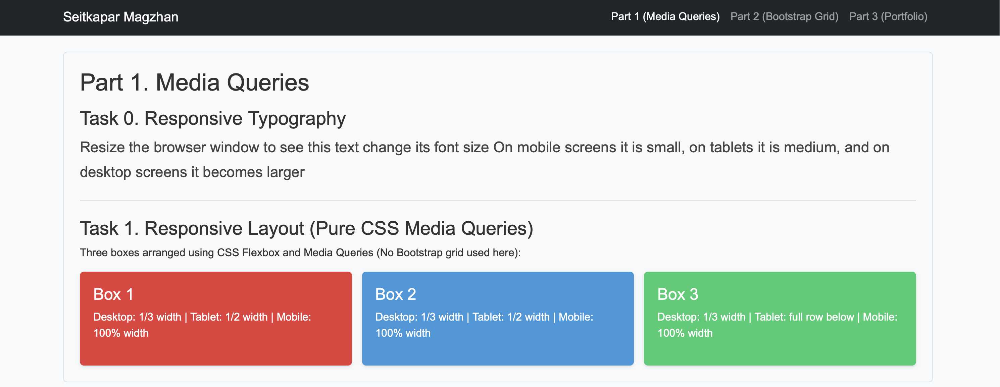
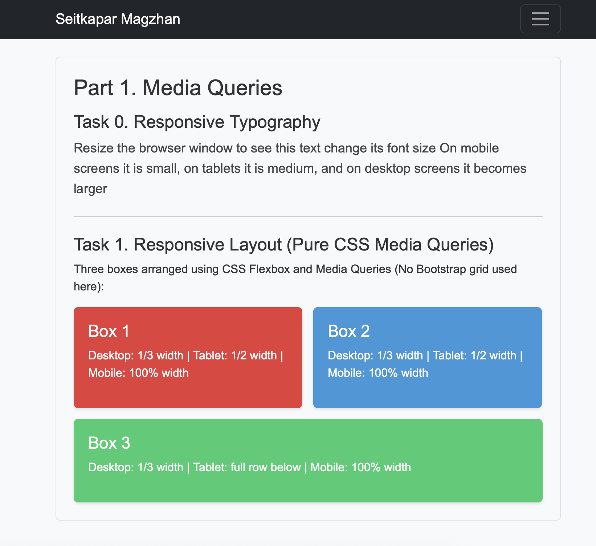
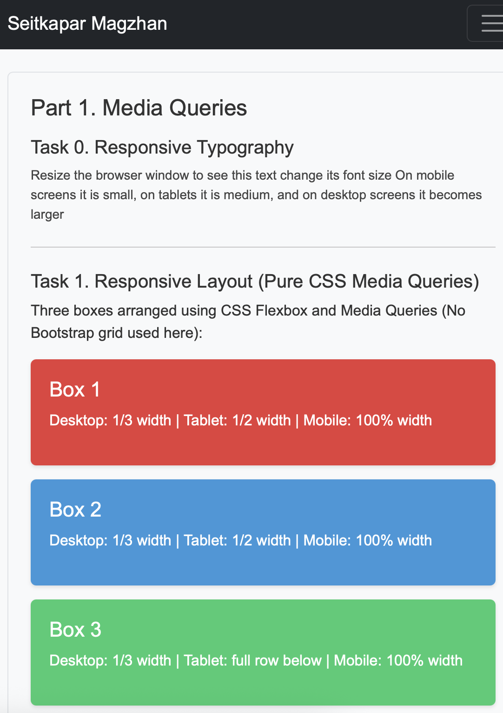
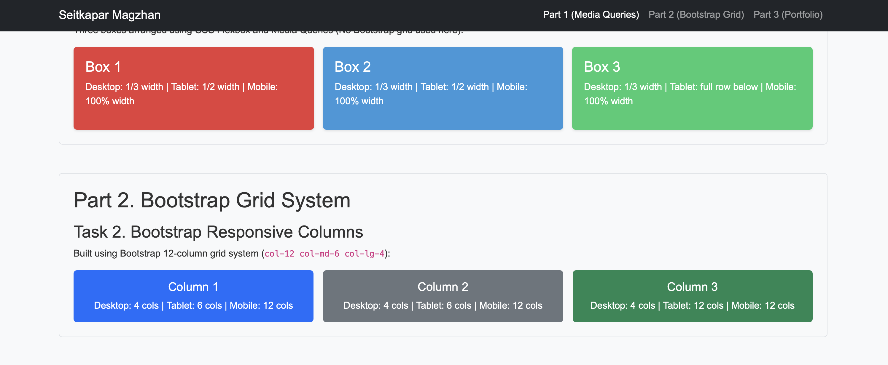
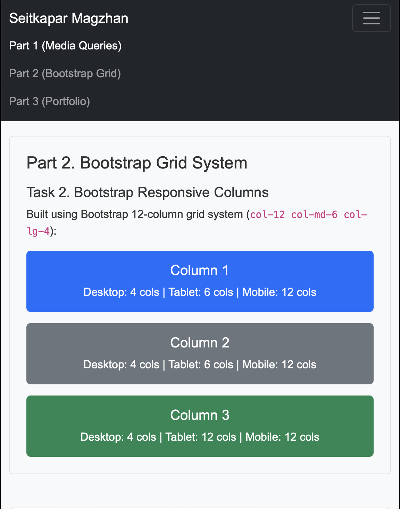
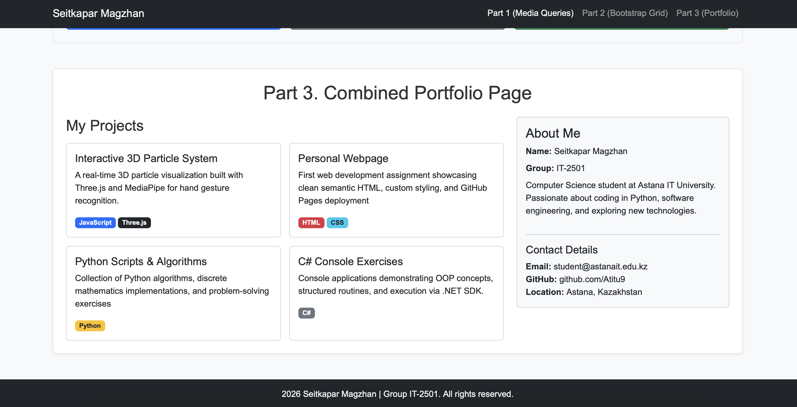
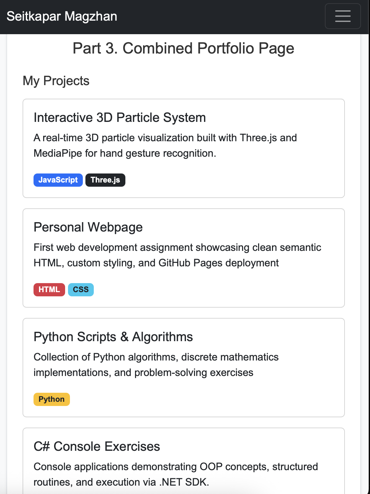
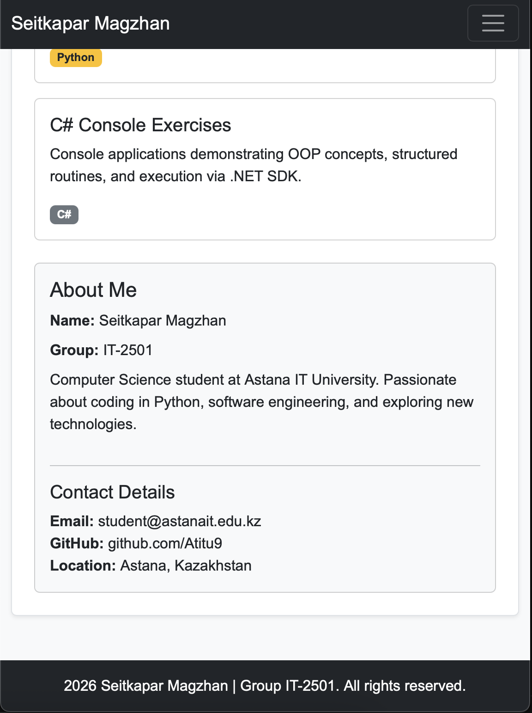

# Assignment 3: Responsive Web Design

**Name:** Seitkapar Magzhan  
**Group:** IT-2501  

---
## Description

This assignment focuses on creating responsive web pages using CSS Media Queries and the Bootstrap 5 Grid system. The main goal was to design layouts that automatically adapt to different screen sizes—desktop, tablet, and mobile—while learning how to work with Bootstrap's 12-column grid and navigation components
## Tasks

### Part 1. Media Queries
 **Task 0. Responsive Typography:** Made heading and paragraph text resize dynamically using CSS media queries (smaller for mobile, medium for tablet, larger for desktop).
 **Task 1. Responsive Layout with Media Queries:** Created 3 colored boxes using flexbox and custom `@media` rules without Bootstrap. On desktop they sit side-by-side, on tablet two go on the first row and one below, and on mobile they stack vertically.

### Part 2. Bootstrap Grid System
 **Task 2. Bootstrap Responsive Columns:** Built a layout with Bootstrap 12-column grid system using `col-12 col-md-6 col-lg-4` to automatically change column arrangements across screen sizes.
 **Task 3. Bootstrap Navigation Bar:** Added a navbar with a logo on the left and links on the right, which collapses into a working hamburger menu on small viewports.

### Part 3. Combined Project
 **Task 4. Responsive Portfolio Page:** Assembled a full portfolio layout containing the navbar, a left side with project cards, a right sidebar with personal info, and a footer. Added CSS media queries for fine-tuning margins and font sizing.

---

## Screenshots

### Part 1 (Media Queries)
Desktop View:

Tablet View:

Mobile View:

### Part 2 (Bootstrap Grid)
Desktop View:

Mobile View:

### Part 3 (Portfolio Page)
Desktop View:

Mobile View:

---

## Summary

 Set up basic HTML elements and connected Bootstrap 5 CDN along with custom `style.css`
 Wrote CSS media queries to control typography scaling and box layouts for 768px and 992px breakpoints
 Used Bootstrap grid utility classes to make project cards and sidebar wrap correctly.
 Checked all views using DevTools device mode to make sure everything looks clear and doesn't break on small screens